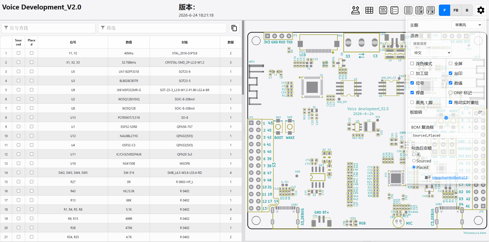
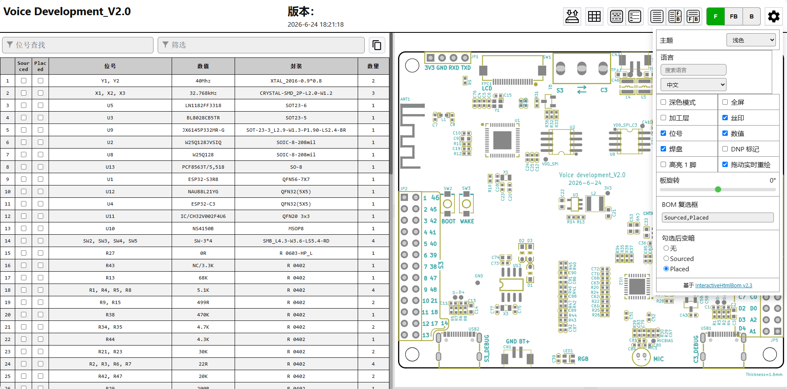
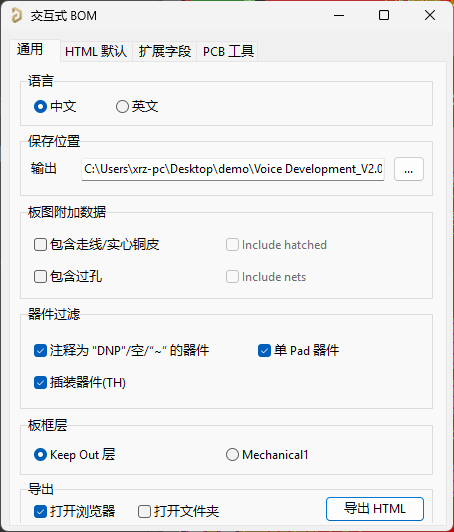

# InteractiveHtmlBom-AD

`InteractiveHtmlBom-AD` is an Altium Designer script oriented adaptation of
[InteractiveHtmlBom](https://github.com/openscopeproject/InteractiveHtmlBom).
It keeps the familiar interactive HTML BOM experience while making the export
workflow usable from Altium script projects.

`InteractiveHtmlBom-AD` 是一个面向 Altium Designer 脚本环境的
`InteractiveHtmlBom` 改进版。项目保留了交互式 HTML BOM 的核心体验，并把
导出流程适配到了 AD 脚本环境中，方便直接从 PCB 文档生成可交互的装配页面。

## Screenshots / 界面展示

<table>
  <tr>
    <td align="center" width="50%">
      
       
      <strong>Apple Theme Preview / Apple 风主题预览</strong>
       
      Shows the polished Apple-style interface, compact controls and multilingual selector.
       
      展示 Apple 风整体界面、更紧凑的控制区，以及多语言选择器效果。
    </td>
    <td align="center" width="50%">
      
       
      <strong>Light Theme Preview / 浅色主题预览</strong>
       
      Highlights the clean light layout, simplified info panel and optimized BOM viewing experience.
       
      展示浅色主题下更清爽的布局、简化后的信息区，以及优化后的 BOM 浏览体验。
    </td>
  </tr>
  <tr>
    <td align="center" colspan="2">
      
       
      <strong>AD Export Window / AD 导出窗口</strong>
       
      Shows the bilingual AD export panel, grouped layout and primary export action.
       
      展示 AD 导出窗口的中英文切换、分组布局，以及底部主导出按钮。
    </td>
  </tr>
</table>

## Compatibility / 兼容性

- Altium Designer: tested on AD10 and AD24.
  Altium Designer：已在 AD10 与 AD24 实测可用。
- Script entry points: `startWin()` for GUI mode and `main()` for direct export.
  脚本入口：`startWin()` 用于界面模式，`main()` 用于无界面直接导出。

## Highlights / 特性亮点

- Supports Altium Designer script workflow, tested on AD10 and AD24.
  支持 Altium Designer 脚本工作流，已在 AD10 与 AD24 验证。
- Provides both GUI mode and direct script export mode.
  同时提供 GUI 模式与脚本直接导出模式。
- Exports interactive HTML BOM for assembly and inspection.
  可导出用于装配与检视的交互式 HTML BOM。
- Includes helper exports for JSON, TXT BOM and CSV PnP.
  内置 JSON、TXT BOM 和 CSV PnP 等辅助导出能力。
- Supports front/back board view, dark mode and multiple display options.
  支持正反面视图、深色模式以及多种显示选项。
- Adds board outline auto-detection between `Mechanical1` and `Keep Out Layer`.
  增加 `Mechanical1` 与 `Keep Out Layer` 之间的板框层自动判断。
- Includes multilingual messages for common prompts.
  常见提示信息支持多语言显示。

## Project Structure / 项目结构

- `core/`: configuration, BOM generation and output assembly.
  `core/`：配置、BOM 生成与输出拼装。
- `ecad/`: Altium PCB parsing logic.
  `ecad/`：Altium PCB 解析逻辑。
- `dist/`: distributable script entry and GUI code.
  `dist/`：分发用脚本入口与 GUI 代码。
- `web/`: frontend assets used by generated HTML output.
  `web/`：生成 HTML 页面所需的前端资源。
- `tools/`: helper exporters such as JSON / TXT / PnP CSV.
  `tools/`：JSON / TXT / PnP CSV 等辅助导出工具。
- `Initialize.bat`: combines scripts into the distributable entry file.
  `Initialize.bat`：将脚本拼接为可分发入口文件。

## Installation / 安装方法

1. Run `Initialize.bat` once in the project root.
   在项目根目录运行一次 `Initialize.bat`。
2. Open `InteractiveHtmlBom.PrjScr` in Altium Designer.
   在 Altium Designer 中打开 `InteractiveHtmlBom.PrjScr`。
3. Open a `PcbDoc`, then open `Run Script...`.
   打开一个 `PcbDoc`，再打开 `Run Script...`。
4. Run `startWin()` to launch the GUI, or run `main()` for direct export.
   运行 `startWin()` 启动界面，或运行 `main()` 直接导出。

## Usage / 使用方式

After opening the GUI, you can:
打开 GUI 后，你可以：

- Choose the output HTML path.
  选择输出 HTML 路径。
- Configure blacklists such as empty value, one-pad and through-hole parts.
  配置空值、单焊盘、通孔器件等过滤规则。
- Select the PCB outline source layer.
  选择板框来源层。
- Toggle pads, silkscreen, fabrication layer and dark mode options.
  切换焊盘、丝印、制造层、深色模式等显示选项。
- Generate HTML BOM and open the output folder.
  生成 HTML BOM，并可按设置打开浏览器或输出目录。

- Switch the AD export window between `中文 / English`.
  在 AD 导出窗口中切换 `中文 / English` 界面语言。

Generated files are typically written into a `PnPout` directory near the current
PCB document.
生成文件通常会输出到当前 PCB 文档附近的 `PnPout` 目录中。

## What's New / 本次新增功能

- Improved launch workflow: `startWin()` is recommended for GUI export, while
  `main()` is still kept for direct export.
  启动方式优化：推荐先运行 `startWin()` 打开 GUI，再点击 Generate 生成 HTML；
  同时保留 `main()` 直接导出模式。
- Simplified project entry: the script project file is now
  `InteractiveHtmlBom.PrjScr`, which is shorter and clearer.
  工程入口简化：脚本工程文件改为 `InteractiveHtmlBom.PrjScr`，名称更短、更直观。
- Initialization self-check: opening the GUI or clicking Generate now verifies
  whether initialization has been completed, and prompts users to run
  `Initialize.bat` when needed.
  初始化自检：打开 GUI 或点击 Generate 时会检查脚本是否已初始化，未初始化时会
  提示先运行 `Initialize.bat`。
- Smarter board outline detection between `Mechanical1` and
  `Keep Out Layer` to reduce outline selection errors.
  板框层智能预判：自动在 `Mechanical1` 与 `Keep Out Layer` 之间做板框层猜测，
  减少板框识别错误。
- Multilingual frontend support for `中文 / English / 日本語 / 한국어`.
  前端多语言：HTML 页面支持 `中文 / English / 日本語 / 한국어`。
- Searchable language selector for faster language switching.
  语言搜索：语言下拉框加入搜索框，语言较多时更容易定位。
- More complete page translations across menus, export, filters, metadata and
  dialogs.
  页面翻译补齐：菜单、导出、筛选、元数据、弹窗等常用文案已补齐本地化。
- Multiple built-in themes: `Light / Dark / Apple / Blue Gray / Eye Care Green`.
  多主题系统：新增 `Light / Dark / Apple / Blue Gray / Eye Care Green`
  主题切换。
- Added an Apple-style overall theme with support for following system dark mode.
  Apple 风界面：增加 Apple 风整体主题，并支持跟随系统深色模式切换。
- Refined Apple-style BOM table visuals with improved header, radius, hover and
  highlight consistency.
  Apple 风表格：对 BOM 表格做 Apple 风样式优化，表头、圆角、悬停和高亮表现
  更统一。
- Improved dark theme visibility so buttons and icons stay clear instead of only
  becoming readable on hover.
  深色主题可见性修复：修正深色模式下按钮和图标发灰、只有悬停时才清晰的问题。
- Optimized the top menu into a denser two-column layout for quicker access to
  common options.
  菜单布局优化：顶部选项区改成更紧凑的双列布局，常用开关更容易查看和操作。
- Unified font stack for better Chinese and English mixed-text appearance.
  字体与中英混排优化：统一页面字体栈，改善中文和英文混排时的观感与一致性。
- Reduced the visual size of the language selector while keeping readability.
  语言选择器优化：缩小语言区域尺寸，不再显得过大，同时保留可读性。
- Added a lightweight startup animation when opening the exported HTML page.
  启动动画：打开导出的 HTML 时显示轻量启动动画，增强页面打开时的仪式感。
- Added right-click canvas panning while preserving right-click reset behavior.
  右键拖动画布：PCB 画布除左键/中键外，右键也可以拖动平移；右键单击仍可快速
  复位视图。
- Localized script prompts based on AD locale settings, with friendlier Chinese
  error messages.
  脚本提示本地化：常见脚本报错已支持按 AD 本地资源设置自动切换提示语言，并对
  中文环境做了更友好的错误提示。
- Improved prompts when the current document is not a PCB document.
  文档不是 PCB 时的提示优化：例如 `Current document is not a PCB document`
  已改为更清晰、更适合中文用户理解的提示。
- Removed the version row from the generated HTML page for a cleaner info panel.
  页面信息简化：移除了 HTML 页面里的版本显示行，使信息区更干净。
- `main()` now redirects to the GUI workflow so the export options stay
  consistent with `startWin()`.
  `main()` 入口已改为跳转到 GUI 导出流程，避免与 `startWin()` 的导出选项分离。
- Added bilingual AD export UI with `中文 / English` switching and remembered
  language preference.
  AD 导出窗口新增 `中文 / English` 双语切换，并会记住上次使用的界面语言。
- Reorganized the AD export window into clearer sections such as `Language`,
  `Save to`, `Board data`, `Component filters`, `Outline layer` and `Export`.
  AD 导出窗口重新整理为更清晰的分组，例如 `Language`、`Save to`、`Board data`、
  `Component filters`、`Outline layer`、`Export`，结构更直观。
- Improved the AD export panel with a cleaner Apple-inspired layout, updated
  typography, tighter spacing and a clearer primary `Export HTML` action.
  AD 导出面板视觉优化：采用更简洁的 Apple 风布局思路，更新字体、收紧留白，并
  增强 `Export HTML` 主按钮的识别度。
- The AD export window is now resizable, with key controls stretching with the
  window to avoid overlapping sections during resize.
  AD 导出窗口现已支持拖动缩放，关键控件会随窗口拉伸，自适应避免分组互相遮挡。
- Fixed export-panel layout issues where the export button could be hidden or
  collide with the outline selection area after resizing.
  修复导出区布局问题：解决窗口缩放后导出按钮被遮挡、以及板框层选择区域与其它
  分组相互挤压的问题。

## Extra Export Tools / 额外导出工具

Besides HTML BOM generation, the script also provides helper exports:
除了 HTML BOM 生成之外，脚本还提供以下辅助导出：

- `exportJSON()`: exports parsed PCB and component data as JSON.
  `exportJSON()`：将解析后的 PCB 与器件数据导出为 JSON。
- `exportBOM()`: exports BOM as tab-separated TXT.
  `exportBOM()`：将 BOM 导出为制表符分隔的 TXT。
- `exportPnP()`: exports pick-and-place data as CSV.
  `exportPnP()`：将贴片坐标数据导出为 CSV。

## Notes / 说明

- This project is based on the original
  [InteractiveHtmlBom](https://github.com/openscopeproject/InteractiveHtmlBom)
  idea and workflow.
  本项目基于原始
  [InteractiveHtmlBom](https://github.com/openscopeproject/InteractiveHtmlBom)
  的设计思路与工作流。
- The `web/` directory keeps frontend assets used by the generated viewer.
  `web/` 目录保存生成页面所需的前端资源。
- If you are publishing your own enhanced version, update this README with your
  exact feature list, screenshots and supported Altium versions.
  如果你要继续发布自己的增强版本，建议在 README 中补充准确的功能清单、截图和
  支持的 Altium 版本。

## Credits / 致谢

- Original project / 原始项目:
  [openscopeproject/InteractiveHtmlBom](https://github.com/openscopeproject/InteractiveHtmlBom)
- Original AD adaptation reference / 原始 AD 适配参考:
  [lianlian33/InteractiveHtmlBomForAD](https://github.com/lianlian33/InteractiveHtmlBomForAD)
